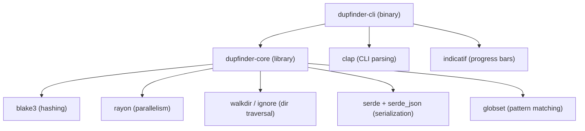

# `dupfinder` — Cross-Platform Duplicate File Detection & Cleanup Recommendation System

## 1. Project Overview

**`dupfinder`** is a CLI-first, cross-platform tool for detecting duplicate files, empty files/folders, and broken symlinks on macOS, Linux, and Windows. Inspired by [czkawka](https://github.com/qarmin/czkawka) and [rmlint](https://github.com/sahib/rmlint), it prioritizes speed, safety, and extensibility.

The MVP is **report-only** — no files are deleted or moved. Users review generated reports (JSON or human-readable) and take action manually.

### Key Design Principles
- **Safety first** — report-only MVP; no destructive operations
- **Speed** — multi-threaded scanning, 3-stage hash pipeline, BLAKE3 hashing, caching
- **Cross-platform** — macOS, Linux, Windows from day one
- **Extensible** — core library + CLI binary architecture for future GUI/web frontends

### Reference Projects
| | czkawka | rmlint | **dupfinder (MVP)** |
|---|---|---|---|
| Language | Rust | C | **Rust** |
| Hash | BLAKE3 | City/MD5/SHA | **BLAKE3** |
| Pipeline | Size → Hash | Size → Partial → Full | **Size → Partial → Full** |
| GUI | GTK4/Slint | — | **— (CLI only)** |
| Cache | JSON | — | **JSON** |
| Deletion | Yes | Script | **Report only** |

---

## 2. Architecture

### 2.1 Crate Structure (Cargo Workspace)

```
my-dup-detector/                    # workspace root
├── Cargo.toml                      # workspace manifest
├── LICENSE                         # MIT
├── README.md
├── dupfinder-core/                 # library crate
│   ├── Cargo.toml
│   └── src/
│       ├── lib.rs                  # public API
│       ├── scanner.rs              # directory traversal
│       ├── hasher.rs               # BLAKE3 hashing pipeline
│       ├── dedup.rs                # duplicate grouping logic
│       ├── empty.rs                # empty file/folder detection
│       ├── symlinks.rs             # broken symlink detection
│       ├── cache.rs                # hash cache (JSON file)
│       ├── filter.rs              # file filtering (size, patterns, depth)
│       ├── report.rs               # report generation (JSON, text)
│       ├── progress.rs             # progress callback trait
│       └── types.rs                # shared types & config structs
└── dupfinder-cli/                  # binary crate
    ├── Cargo.toml
    └── src/
        ├── main.rs                 # entry point, clap CLI setup
        ├── commands/
        │   ├── mod.rs
        │   ├── scan.rs             # `dupfinder scan` subcommand
        │   └── cache.rs            # `dupfinder cache` subcommand
        └── output.rs               # terminal output formatting
```

### 2.2 Dependency Graph



---

## 3. MVP Feature Specification

### 3.1 Duplicate File Detection

**Algorithm: 3-Stage Pipeline** (inspired by rmlint)

```
Stage 1: Size Grouping
  └─ Traverse all target directories
  └─ Group files by exact file size
  └─ Discard groups with only 1 file (unique size = unique file)

Stage 2: Partial Hash
  └─ For each remaining group, read first 8KB of each file
  └─ Compute BLAKE3 hash of the 8KB prefix
  └─ Sub-group by partial hash
  └─ Discard sub-groups with only 1 file

Stage 3: Full Hash
  └─ For remaining files, compute BLAKE3 hash of full content
  └─ Group by full hash
  └─ Files in groups of 2+ are confirmed duplicates
```

**Original Selection:** Within each duplicate group, the file with the **oldest modification time** is marked as the "original" (keep). All others are marked as "duplicates" (redundant).

**Cache Integration:** After computing a full hash, store `(canonical_path, size, mtime, hash)` in the cache. On subsequent scans, if a file's `path + size + mtime` matches a cache entry, reuse the stored hash instead of re-reading the file.

### 3.2 Empty Files Detection

- Find all files with size = 0 bytes
- Report their paths, grouped by parent directory

### 3.3 Empty Folders Detection

- Find directories that contain no files (recursively)
- Handle nested empty directories (a folder containing only other empty folders is itself empty)
- Report paths in bottom-up order (deepest first)

### 3.4 Broken Symbolic Links

- Find symlinks where the target path does not exist or is inaccessible
- Report: symlink path → (missing) target path
- Cross-platform: skip on Windows if symlinks are not applicable or require elevated privileges

---

## 4. CLI Interface Design

### 4.1 Command Structure

```
dupfinder <SUBCOMMAND>

SUBCOMMANDS:
  scan     Scan directories for duplicates, empty files/folders, and broken symlinks
  cache    Manage the hash cache
  help     Print help information
  version  Print version information
```

### 4.2 `dupfinder scan`

```
dupfinder scan [OPTIONS] <PATHS>...

ARGUMENTS:
  <PATHS>...              One or more directories to scan

OPTIONS:
  Detection Features:
    --duplicates           Find duplicate files [default: enabled]
    --empty-files          Find empty (0-byte) files [default: enabled]
    --empty-dirs           Find empty directories [default: enabled]
    --broken-links         Find broken symbolic links [default: enabled]
    --no-duplicates        Disable duplicate detection
    --no-empty-files       Disable empty file detection
    --no-empty-dirs        Disable empty directory detection
    --no-broken-links      Disable broken symlink detection

  Filtering:
    --min-size <SIZE>      Minimum file size to consider (e.g., 1KB, 1MB) [default: 1B]
    --exclude <PATTERN>    Glob pattern(s) to exclude (repeatable)
    --exclude-dir <DIR>    Directory name(s) to skip (repeatable)
                           [built-in defaults: .git, node_modules, __pycache__, .DS_Store]
    --include-hidden       Include hidden files/directories (dotfiles) [default: excluded]
    --depth <N>            Maximum recursion depth (0 = current dir only) [default: unlimited]

  Output:
    -o, --output <FILE>    Write report to file (format inferred from extension: .json, .txt)
    -f, --format <FMT>     Output format: json, text [default: text]
    --quiet                Suppress progress output; only print final report
    --verbose              Show detailed scan information

  Cache:
    --no-cache             Disable hash caching for this scan
    --cache-dir <DIR>      Custom cache directory [default: ~/.dupfinder/]

  General:
    -h, --help             Print help
    -V, --version          Print version
```

### 4.3 `dupfinder cache`

```
dupfinder cache <SUBCOMMAND>

SUBCOMMANDS:
  info     Show cache statistics (entries, size on disk, last updated)
  clear    Delete all cached data
  help     Print help
```

---

## 5. Report Formats

### 5.1 Human-Readable Text (stdout default)

```
═══════════════════════════════════════════════════════════════
  dupfinder v0.1.0 — Scan Report
  Scanned: ~/Documents, ~/Downloads
  Date: 2026-08-14 12:00:00
  Duration: 4.2s
═══════════════════════════════════════════════════════════════

── Duplicate Files ─────────────────────────────────────────────
  Found 3 duplicate groups (7 redundant files, 245.8 MB reclaimable)

  Group 1 — 3 files, 82.4 MB each (SHA: 7f2a3b...)
    [ORIGINAL] ~/Documents/photos/vacation.jpg     (2024-06-15)
    [DUPLICATE] ~/Downloads/vacation.jpg            (2024-07-01)
    [DUPLICATE] ~/Documents/backup/vacation.jpg     (2024-08-10)

  Group 2 — 2 files, 1.2 KB each (SHA: a1c9d2...)
    [ORIGINAL] ~/Documents/notes.txt               (2023-01-15)
    [DUPLICATE] ~/Downloads/notes (1).txt           (2023-03-22)

── Empty Files ─────────────────────────────────────────────────
  Found 4 empty files

    ~/Documents/drafts/.placeholder
    ~/Downloads/.gitkeep
    ~/Documents/temp/empty.log
    ~/Documents/temp/blank.txt

── Empty Directories ───────────────────────────────────────────
  Found 2 empty directories

    ~/Documents/old-project/build/
    ~/Documents/old-project/dist/

── Broken Symbolic Links ───────────────────────────────────────
  Found 1 broken symbolic link

    ~/bin/old-tool → /usr/local/bin/removed-tool (target missing)

── Summary ─────────────────────────────────────────────────────
  Scanned:          15,432 files in 2,105 directories
  Duplicates:       3 groups (7 redundant files, 245.8 MB reclaimable)
  Empty files:      4
  Empty dirs:       2
  Broken symlinks:  1
  Cache hits:       12,891 / 15,432 (83.5%)
═══════════════════════════════════════════════════════════════
```

### 5.2 JSON Report

```json
{
  "version": "0.1.0",
  "scan": {
    "paths": ["~/Documents", "~/Downloads"],
    "timestamp": "2026-08-14T12:00:00Z",
    "duration_secs": 4.2,
    "files_scanned": 15432,
    "dirs_scanned": 2105
  },
  "duplicates": {
    "total_groups": 3,
    "total_redundant_files": 7,
    "reclaimable_bytes": 257816371,
    "groups": [
      {
        "hash": "7f2a3b...",
        "size": 86400000,
        "files": [
          { "path": "~/Documents/photos/vacation.jpg", "mtime": "2024-06-15T10:30:00Z", "role": "original" },
          { "path": "~/Downloads/vacation.jpg", "mtime": "2024-07-01T14:22:00Z", "role": "duplicate" },
          { "path": "~/Documents/backup/vacation.jpg", "mtime": "2024-08-10T09:15:00Z", "role": "duplicate" }
        ]
      }
    ]
  },
  "empty_files": {
    "total": 4,
    "files": ["~/Documents/drafts/.placeholder", "..."]
  },
  "empty_dirs": {
    "total": 2,
    "dirs": ["~/Documents/old-project/build/", "..."]
  },
  "broken_symlinks": {
    "total": 1,
    "links": [
      { "path": "~/bin/old-tool", "target": "/usr/local/bin/removed-tool" }
    ]
  },
  "cache": {
    "hits": 12891,
    "misses": 2541,
    "hit_rate": 0.835
  }
}
```

---

## 6. Core Library API Design (`dupfinder-core`)

### 6.1 Public API Surface

```rust
// Configuration
pub struct ScanConfig {
    pub paths: Vec<PathBuf>,
    pub features: FeatureFlags,          // which detections to run
    pub filters: FilterConfig,            // min_size, exclude patterns, etc.
    pub cache_config: CacheConfig,        // cache dir, enabled/disabled
    pub max_depth: Option<usize>,
    pub include_hidden: bool,
}

pub struct FilterConfig {
    pub min_size: u64,
    pub exclude_patterns: Vec<String>,    // glob patterns
    pub exclude_dirs: Vec<String>,        // directory names
}

// Results
pub struct ScanReport {
    pub scan_info: ScanInfo,              // paths, duration, counts
    pub duplicates: DuplicateReport,
    pub empty_files: Vec<PathBuf>,
    pub empty_dirs: Vec<PathBuf>,
    pub broken_symlinks: Vec<BrokenSymlink>,
    pub cache_stats: CacheStats,
}

pub struct DuplicateGroup {
    pub hash: String,
    pub size: u64,
    pub original: FileEntry,              // oldest mtime
    pub duplicates: Vec<FileEntry>,       // all others
}

// Progress callback
pub trait ProgressHandler: Send + Sync {
    fn on_phase_start(&self, phase: ScanPhase, total: Option<u64>);
    fn on_progress(&self, phase: ScanPhase, current: u64, message: &str);
    fn on_phase_end(&self, phase: ScanPhase);
}

// Main entry point
pub fn scan(config: ScanConfig, progress: &dyn ProgressHandler) -> Result<ScanReport>;
```

---

## 7. Technical Decisions Summary

| Decision | Choice | Rationale |
|---|---|---|
| Language | **Rust** | Memory safety, speed, cross-platform |
| Binary name | **`dupfinder`** | Clear, memorable |
| Hash algorithm | **BLAKE3** | Faster than SHA-256, cryptographic-grade |
| Detection pipeline | **3-stage** (size → partial → full) | Avoids unnecessary I/O |
| Parallelism | **rayon** | Safe, ergonomic data parallelism |
| Cache format | **JSON file** (`~/.dupfinder/cache.json`) | Human-inspectable, no extra deps |
| Report formats | **JSON + human-readable text** | Machine + human consumption |
| Original heuristic | **Oldest mtime** | Most common assumption: first = original |
| Architecture | **Monorepo workspace** (core + cli) | Reusable core for future frontends |
| CLI framework | **clap** (derive) | Rust ecosystem standard |
| Progress display | **indicatif** | Rich progress bars with ETA |
| License | **MIT** | Maximally permissive |
| MVP scope | **Report-only**, no deletion | Safety first |

---

## 8. Key Rust Dependencies

| Crate | Purpose | Version guidance |
|---|---|---|
| `clap` (derive) | CLI argument parsing | Latest stable |
| `blake3` | Content hashing | Latest stable |
| `rayon` | Parallel iterators | Latest stable |
| `walkdir` | Recursive directory traversal | Latest stable |
| `serde` + `serde_json` | Serialization (cache, JSON report) | Latest stable |
| `globset` | Glob-based pattern matching | Latest stable |
| `indicatif` | Terminal progress bars | Latest stable |
| `chrono` | Timestamps in reports | Latest stable |
| `anyhow` | Error handling in CLI | Latest stable |
| `thiserror` | Typed errors in core library | Latest stable |

---

## 9. Cross-Platform Considerations

| Concern | macOS | Linux | Windows |
|---|---|---|---|
| Hidden files | `.` prefix | `.` prefix | File attribute flag |
| Symlinks | Full support | Full support | Limited (may need admin) |
| File metadata | `std::fs::metadata` | `std::fs::metadata` | `std::fs::metadata` |
| Default cache dir | `~/Library/Caches/dupfinder/` or `~/.dupfinder/` | `~/.cache/dupfinder/` (XDG) | `%LOCALAPPDATA%/dupfinder/` |
| Path separators | `/` | `/` | `\` (use `PathBuf`) |

> [!IMPORTANT]
> Use the `dirs` crate for platform-correct cache/config directory resolution following XDG on Linux, `~/Library/` on macOS, and `%LOCALAPPDATA%` on Windows.

---

## 10. Verification Plan

### Unit Tests (MVP)
- **Hasher:** Verify BLAKE3 partial hash (8KB) and full hash produce correct, deterministic results
- **Cache:** Test cache hit/miss logic with matching/mismatched `(path, size, mtime)` tuples
- **Dedup:** Test duplicate grouping and original selection (oldest mtime wins)
- **Filter:** Test glob exclusion, min-size filtering, hidden file exclusion, depth limiting
- **Empty detection:** Test nested empty directory resolution
- **Symlink:** Test broken symlink detection

### Manual Verification
- Run against the user's home directory and verify report correctness
- Test on macOS (primary), verify on Linux, smoke-test on Windows
- Benchmark: scan 100K+ file directory, verify sub-10-second completion with warm cache

---

## 11. Future Roadmap (Post-MVP)

> [!NOTE]
> These are explicitly **out of scope** for the MVP but inform architectural decisions.

- **Deletion modes:** Move to trash, hardlink, symlink replacement, reflink (BTRFS/APFS)
- **Interactive CLI:** TUI-based duplicate review with `ratatui`
- **GUI frontend:** Slint or Tauri-based desktop app consuming `dupfinder-core`
- **Similar images/videos:** Perceptual hashing (pHash) for near-duplicate media
- **Duplicate directories:** Group-level deduplication (entire folder trees)
- **Config file:** `~/.dupfinder/config.toml` for persistent default settings
- **Shell completions:** Auto-generated for bash, zsh, fish, PowerShell
- **CI/CD:** GitHub Actions for cross-platform build + test + release binaries
